<p align="center">
  
</p>

<h1 align="center">✍️ Vibe Writing is Coming — Write Faster and Better!</h1>

<p align="center">
  <strong>Litewrite: AI-Powered Collaborative LaTeX Writing Platform</strong><br>
</p>

<p align="center">
  <a href="https://github.com/hkuds/litewrite"></a>
  <a href="./LICENSE"></a>
  <a href="https://github.com/hkuds/litewrite/actions"></a>
  
  
  
  
</p>

<p align="center">
  <a href="https://discord.gg/M88Y27DDEe"></a>
  <a href="https://github.com/HKUDS/Litewrite/issues/4"></a>
</p>

<p align="center">
  <a href="https://litewrite.ai"></a>
</p>

<p align="center">
  <a href="#-news">News</a> &bull;
  <a href="#-features">Features</a> &bull;
  <a href="#-screenshots">Screenshots</a> &bull;
  <a href="#%EF%B8%8F-architecture">Architecture</a> &bull;
  <a href="#-ai-features">AI Features</a> &bull;
  <a href="#-nanobot--chat-platform-integration">nanobot</a> &bull;
  <a href="#-quick-start">Quick Start</a> &bull;
  <a href="#-contributing">Contributing</a>
</p>

[*Try Litewrite:*](https://litewrite.ai/)

---

## 📰 News

- **2026-02-10** 🤖 **[nanobot × Litewrite](https://github.com/HKUDS/nanobot) — nanobot empowers your vibe writing ([setup guide](nanobot/DEPLOYMENT.md))
- **2026-02-03** 🎉 **Litewrite v1.0.7** — Real-time collaboration, LaTeX compilation & AI chat.

---

## ✨ Features

🚀 **TAP Smart Completion** — Type a few words, AI continues writing for you. Just hit Tab and you're all set!

💬 **ASK Mode** — Summon your AI assistant anytime. Grammar issues? Format problems? Just ask!

🤖 **Agent Mode** — The ultimate hands-off writing experience! AI automatically edits, polishes, formats!

🔍 **Deep Research** — AI conducts in-depth research and auto-generates reports. Research while you write!

📱 **[nanobot](https://github.com/HKUDS/nanobot)** — Chat with your projects from IM apps. Compile, edit, and manage — all from your phone!

---

<p align="center">
  
</p>
<p align="center"><em>💬 Chat with your projects from IM apps</em></p>

---

## 📸 Screenshots

<details>
<summary><b>Click to expand screenshots</b></summary>

<br>

#### 🏠 Landing Page
<p align="center">
  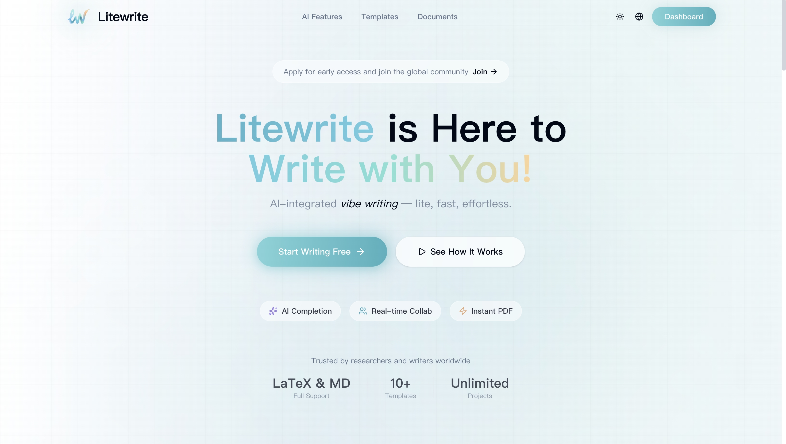
</p>
<p align="center"><em>AI-integrated vibe writing — lite, fast, effortless</em></p>

#### 📚 Template Gallery
<p align="center">
  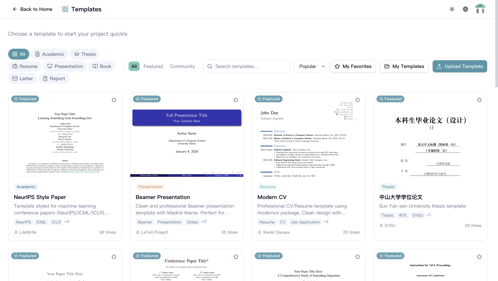
</p>
<p align="center"><em>10+ pre-built templates: NeurIPS, ACM, Beamer, CV, Thesis, and more</em></p>

#### 🔣 Symbol Panel
<p align="center">
  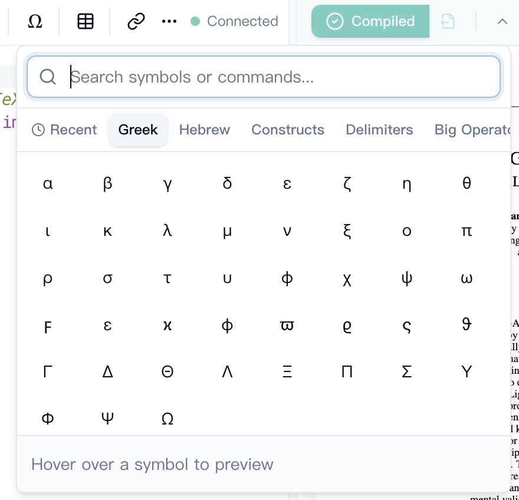
</p>
<p align="center"><em>Quick insert Greek letters, math operators, and LaTeX constructs</em></p>

#### 📖 Reference Search
<p align="center">
  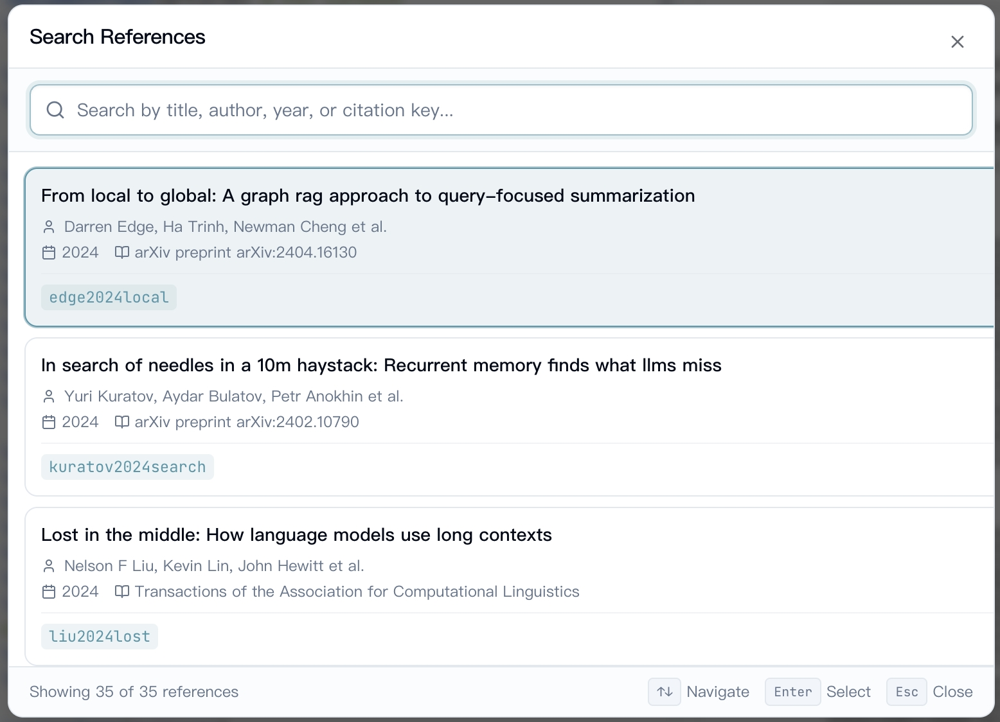
</p>
<p align="center"><em>Search and insert BibTeX citations with fuzzy matching</em></p>

#### 📜 Version History
<p align="center">
  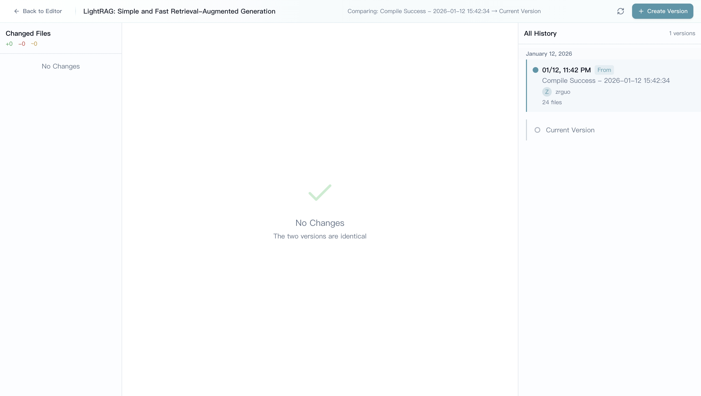
</p>
<p align="center"><em>Create snapshots, compare diffs, and restore any previous version</em></p>

#### 🔗 Project Sharing
<p align="center">
  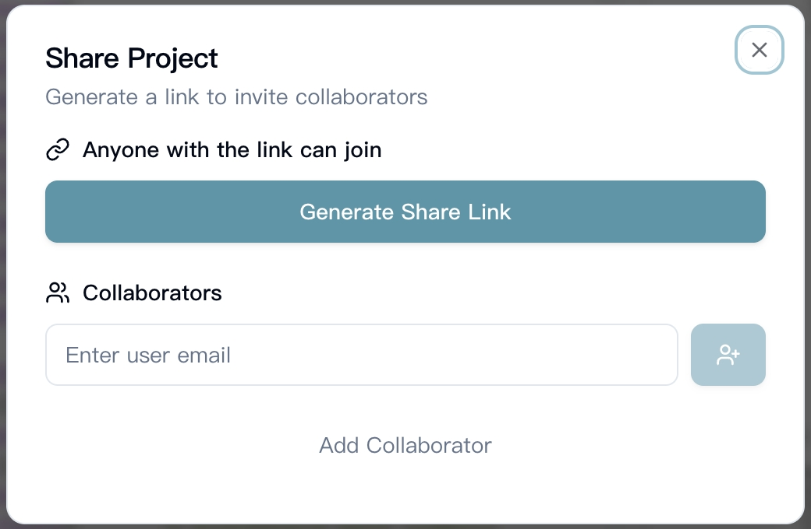
</p>
<p align="center"><em>Share via link or invite collaborators by email</em></p>

</details>

> 💡 **Try it yourself:** Visit [litewrite.ai](https://litewrite.ai) for the live demo!

---

## 🏗️ Architecture

Litewrite is a microservices architecture with 6 core services communicating over a Docker network.

<p align="center">
  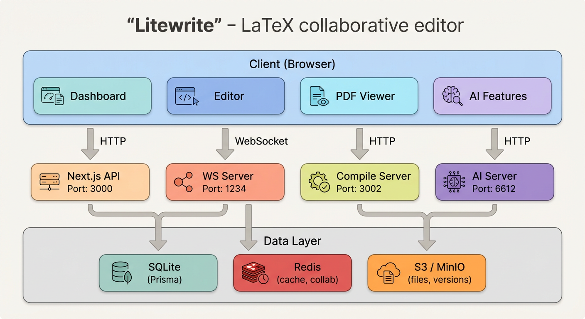
</p>

| Service | Port | Technology | Role |
|---------|------|------------|------|
| 🌐 **Next.js** | 3000 | TypeScript, React | Web app, API routes, auth, project management |
| 🔄 **WebSocket** | 1234 | Node.js, Yjs | Real-time collaboration, document sync, chat rooms |
| 🧠 **AI Server** | 6612 | Python, FastAPI | TAP completion, Chat Agent, Deep Research |
| 📄 **Compile** | 3002 | Node.js, TeXLive | LaTeX compilation (pdfLaTeX/XeLaTeX/LuaLaTeX) |
| 🤖 **nanobot** | — | Python, LiteLLM | Telegram/Feishu bot, Litewrite project operations |
| ⚡ **Redis** | 6379 | Redis | Yjs persistence, rate limiting, caching |

> 🔒 All internal service-to-service communication is authenticated via `X-Internal-Secret` header.

---

## 🧠 AI Features

Litewrite's AI capabilities are powered by a modular Agent system built on Python FastAPI. The architecture follows a **MainAgent + SubAgent** orchestration pattern with a unified Tool layer.

<p align="center">
  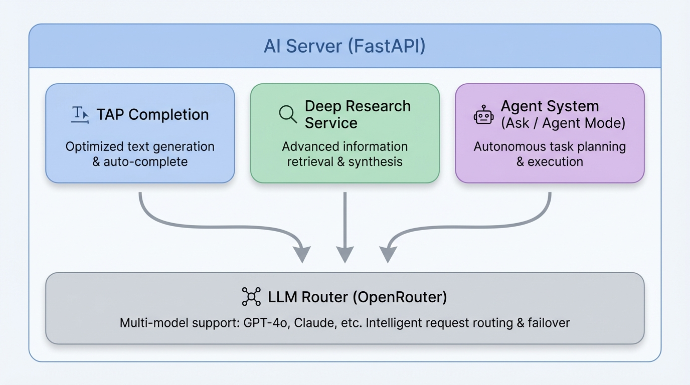
</p>

### ⚡ TAP Completion (Type-Ahead Prediction)

Ghost-text AI completion as you type, similar to GitHub Copilot.

| Stage | Description |
|-------|-------------|
| **Input** | `prefix` (text before cursor) + `suffix` (text after cursor) |
| **Processing** | Boundary extraction → Scenario detection → LLM inference |
| **Output** | Action type (`insert` / `complete_word` / `fix` / `skip`) + suggested text |
| **Post-processing** | Boundary fixups → Diff computation → Frontend rendering |

### 🤖 Agent System (Ask & Agent Mode)

The Agent system uses a **ReAct-style** loop with tool calling for complex writing tasks.

<p align="center">
  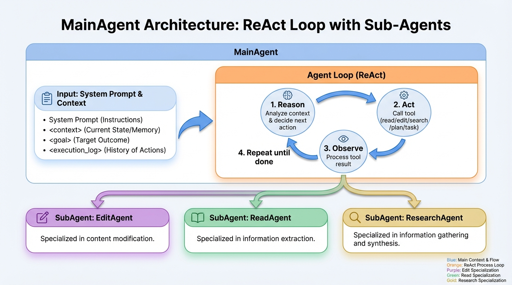
</p>

**Mode-based Tool Availability:**

| Tool | Ask Mode | Agent Mode | Description |
|------|:--------:|:----------:|-------------|
| `read_file` | ✅ | ✅ | Read file content with line ranges |
| `list_files` | ✅ | ✅ | List project files and structure |
| `web_search` | ✅ | ✅ | Search the web for information |
| `arxiv_search` | ✅ | ✅ | Search arXiv papers with RAG |
| `plan` | ✅ | ✅ | Generate step-by-step plan |
| `done` | ✅ | ✅ | Signal task completion |
| `edit_file` | — | ✅ | Edit file with diff preview |
| `task` | — | ✅ | Delegate to SubAgent |

**Context Management:**
- 📦 Session history limit: 64K tokens (configurable)
- 📦 Execution context limit: 64K tokens (configurable)
- 🔄 Automatic LLM-based compression when threshold (95%) is exceeded
- 🛡️ Shadow documents for safe edit preview (or direct-apply for trusted callers)

### 🔍 Deep Research

Multi-source research with automatic report generation.

<p align="center">
  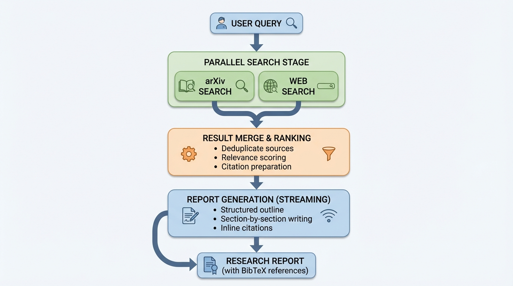
</p>

### 🔧 Unified Tool Layer

All tools inherit from a base `Tool` class with standardized interfaces:

```python
class Tool(ABC):
    name: str              # Tool identifier
    description: str       # LLM-readable description
    parameters: dict       # JSON Schema for parameters
    mode: ToolMode         # ask / agent / all

    async def execute(params, context) -> ToolResult
```

The `ToolContext` provides:
- 📋 Project and user information
- 📡 SSE event emitter for real-time frontend updates
- 🔓 `direct_apply` flag for trusted callers (bypasses shadow documents)
- 📊 Shared usage accumulator for token tracking

---

## 📱 [nanobot](https://github.com/HKUDS/nanobot) — Chat Platform Integration

[nanobot](https://github.com/HKUDS/nanobot) is an AI assistant that connects messaging platforms (Telegram, Feishu/Lark) to Litewrite, enabling users to manage LaTeX projects through natural language conversations.

> 📖 For detailed setup instructions, see the [nanobot Deployment Guide](nanobot/DEPLOYMENT.md).

<!-- TODO: Replace with nanobot architecture image -->

<p align="center">
  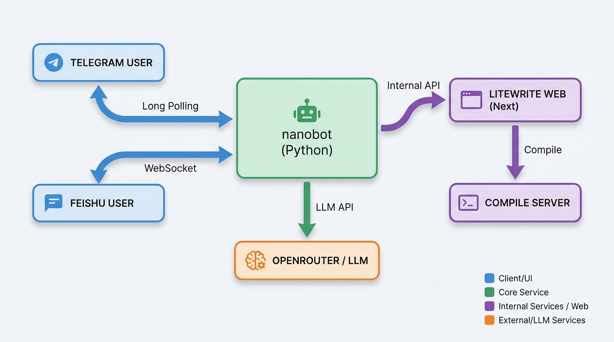
</p>

### 🛠️ Key Capabilities

nanobot provides **20 Litewrite tools** for comprehensive project management:

| Category | Tools |
|----------|-------|
| 🎯 **Core** | List projects, invoke Litewrite AI agent, compile to PDF |
| 📁 **File Operations** | List, read, edit, create, rename, delete, upload files |
| 📦 **Project Management** | Create, delete, rename projects |
| 📜 **Version Control** | List, save, restore versions |
| 📥 **Import** | Import from arXiv, GitHub/GitLab, or file upload |

### ⚙️ How It Works

1. 💬 User sends a message in Telegram or Feishu
2. 🧠 nanobot's agent processes the message with LLM reasoning
3. 🔧 Agent decides which Litewrite tools to call
4. 🔐 Tools communicate with Litewrite via Internal API (`X-Internal-Secret`)
5. 📤 Results (text, PDF, etc.) are sent back to the chat platform

### 💾 Session Management

- 🔗 Per-project session cache: consecutive calls reuse the same conversation
- 👁️ Sessions appear in the Litewrite web UI as **"nanobot"** conversations
- 🤝 The `litewrite_agent` tool delegates complex tasks to Litewrite's built-in AI agent, combining nanobot's chat interface with Litewrite's full editing capabilities

---

## 🚀 Quick Start

### Prerequisites

- [Docker Desktop](https://www.docker.com/products/docker-desktop/) (includes Docker Compose)
- 8GB+ RAM recommended (TeXLive image is ~5GB)

### Development Setup

```bash
# Clone the repository
git clone https://github.com/hkuds/litewrite.git
cd litewrite

# Start with one command
./scripts/up-dev.sh
```

This will:
1. Create `.env` from `env.example.oss` if missing
2. Pull/build all Docker images
3. Start the full stack (web, ws, ai-server, compile, minio, redis)

### 🔗 Access Points

| Service | URL | Description |
|---------|-----|-------------|
| 🌐 **App** | http://localhost:3000 | Main application |
| 📦 **MinIO** | http://localhost:9001 | Object storage console (`minioadmin`/`minioadmin`) |
| 🧠 **AI Server** | http://localhost:6612/health | AI services health check |
| 📄 **Compile** | http://localhost:3002/health | LaTeX compile service |

### 🏭 Production Deployment

```bash
# With custom env files
./scripts/up-prod.sh --env-file .env.production --env-file .env.secrets
```

<details>
<summary><b>📋 Required Environment Variables</b></summary>

| Variable | Description |
|----------|-------------|
| `NEXTAUTH_SECRET` | Random string for session encryption |
| `INTERNAL_API_SECRET` | Internal service authentication |
| `DATABASE_URL` | PostgreSQL connection string |
| `S3_BUCKET` | S3 bucket name |
| `S3_REGION` | S3 region |
| `S3_ACCESS_KEY_ID` | S3 access key |
| `S3_SECRET_ACCESS_KEY` | S3 secret key |
| `OPENROUTER_API_KEY` | AI service API key |

See `env.example.oss` for the complete configuration reference.

</details>

---

## 🛠 Tech Stack

<table>
<tr>
<td>

### 🎨 Frontend
- **Framework:** Next.js 14 (App Router)
- **Language:** TypeScript 5
- **Editor:** CodeMirror 6 + y-codemirror.next
- **UI:** Tailwind CSS + Shadcn UI

</td>
<td>

### ⚙️ Backend
- **API:** Next.js API Routes
- **ORM:** Prisma
- **Auth:** NextAuth.js 5
- **Collaboration:** Yjs + y-websocket

</td>
</tr>
<tr>
<td>

### 🧠 AI Services
- **AI Server:** Python FastAPI
- **LLM:** OpenRouter (multi-model)
- **[nanobot](https://github.com/HKUDS/nanobot):** Python + LiteLLM
- **Channels:** Telegram, Feishu/Lark

</td>
<td>

### 🏗️ Infrastructure
- **Database:** SQLite (dev) / PostgreSQL (prod)
- **Cache:** Redis
- **Storage:** S3-compatible (MinIO/AWS)
- **LaTeX:** TeXLive (pdfLaTeX, XeLaTeX, LuaLaTeX)
- **Container:** Docker + Docker Compose

</td>
</tr>
</table>

---

### ✏️ Editor Experience

| Feature | Description |
|---------|-------------|
| 📝 **LaTeX Editor** | Built on CodeMirror 6 with syntax highlighting, smart completion, bracket matching, and folding |
| 📄 **Markdown Editor** | Full GFM support with code highlighting, math rendering (KaTeX), and live preview |
| 👁️ **Visual Editing** | Typora-like WYSIWYG: renders content while editing, shows source at cursor position |
| 📂 **Multi-file Projects** | Organize large documents with `\input{}`, `\include{}`, and proper file tree management |

### 🤖 AI-Powered Writing

| Feature | Description |
|---------|-------------|
| ⚡ **TAP Completion** | Ghost-text AI completion as you type (Cursor/Copilot-like experience) |
| 💬 **Ask AI** | Select text and ask AI to explain, improve, translate, or rewrite |
| 🤖 **Agent Mode** | Full autonomous editing — AI reads, plans, and applies multi-file edits |
| 🔍 **Deep Research** | Multi-iteration research: web + arXiv search, structured report generation with BibTeX |
| 📊 **AI Table** | Generate LaTeX tables from natural language descriptions |
| 📱 **[nanobot](https://github.com/HKUDS/nanobot)** | Manage projects from Telegram/Feishu: edit files, compile PDFs, import papers |

### 👥 Collaboration & Sharing

| Feature | Description |
|---------|-------------|
| 🔄 **Real-time Collaboration** | Multiple users editing simultaneously with cursor presence indicators |
| 📜 **Version History** | Create snapshots, compare diffs, and restore any previous version |
| 🔗 **Sharing** | Share projects via link with granular view/edit permissions |

### 📄 Compilation & Preview

| Feature | Description |
|---------|-------------|
| 🔧 **Multiple Engines** | pdfLaTeX, XeLaTeX, LuaLaTeX with full TeXLive distribution |
| 👁️ **Live Preview** | Auto-compile on save with instant PDF preview |
| 🔀 **SyncTeX** | Bi-directional navigation: click PDF to jump to source, click source to highlight PDF |
| 📦 **Export Options** | Download PDF, source ZIP, or individual files |

---

## 📁 Project Structure

```
litewrite/
├── app/                      # Next.js App Router pages & API routes
│   ├── api/                  # REST API + Internal API endpoints
│   ├── editor/               # Editor page
│   └── (home)/               # Dashboard pages
├── components/               # React components
│   ├── editor/               # Editor-specific components
│   ├── pdf-viewer/           # PDF preview components
│   └── ui/                   # Shadcn UI components
├── lib/                      # Shared utilities
├── prisma/                   # Database schema & migrations
│
├── server/                   # WebSocket collaboration server
│   ├── ws-server.ts          # Yjs WebSocket + HTTP endpoints
│   └── yjs-persistence.ts    # Redis-based Yjs persistence
│
├── ai-server/                # AI service (Python FastAPI)
│   ├── api/                  # Chat, TAP, Deep Research endpoints
│   ├── services/             # Service implementations
│   │   ├── chat_1_5/         # Agent system (MainAgent + SubAgents)
│   │   ├── tap/              # TAP completion service
│   │   └── deep_research/    # Multi-iteration research
│   ├── tools/                # Agent tools (read, edit, search, etc.)
│   └── core/                 # Config, LLM client, caching
│
├── compile-server/           # LaTeX compilation service
│
├── nanobot/                  # Chat platform AI assistant
│   └── nanobot/
│       ├── agent/            # LLM agent loop + 20 Litewrite tools
│       ├── channels/         # Telegram, Feishu, WhatsApp adapters
│       ├── bus/              # Async message bus
│       ├── config/           # Environment-based configuration
│       └── skills/           # Extensible skill system
│
├── docker-compose.yml        # Development configuration
├── docker-compose.prod.yml   # Production configuration
└── scripts/                  # Setup & deployment helpers
```

---

## 🔧 Development

### Common Commands

```bash
# Start development environment
docker compose up

# Start in background
docker compose up -d

# View logs
docker compose logs -f web
docker compose logs -f ai-server
docker compose logs -f nanobot

# Rebuild specific service
docker compose up --build web

# Reset database
docker compose exec web npx prisma migrate reset

# Run TypeScript check
npm run typecheck
```

### 🔥 Hot Reload

| Directory | Service | Auto-reload |
|-----------|---------|-------------|
| `app/`, `components/`, `lib/` | Next.js | ✅ |
| `server/` | WebSocket | ✅ |
| `ai-server/` | AI Server | ✅ |
| `nanobot/` | nanobot | ✅ |
| `compile-server/` | Compile | ❌ (rebuild needed) |

---

## ⚙️ Environment Variables

<details>
<summary><b>📋 Click to expand full list</b></summary>

### Core

| Variable | Description | Default |
|----------|-------------|---------|
| `NEXTAUTH_SECRET` | NextAuth encryption secret | (required) |
| `INTERNAL_API_SECRET` | Internal service auth | (required) |
| `DATABASE_URL` | Database connection | `file:./dev.db` |

### AI Providers

| Variable | Description | Default |
|----------|-------------|---------|
| `OPENROUTER_API_KEY` | LLM API key (required for AI features) | — |
| `OPENROUTER_API_KEYS` | Multiple keys for rotation | — |
| `OPENROUTER_KEY_STRATEGY` | Key rotation: `round_robin`, `random`, `least_used` | `round_robin` |
| `LLM_MODEL` | Default LLM model | `google/gemini-3-flash-preview` |
| `EMBEDDING_API_BASE` | Embedding API URL | `https://openrouter.ai/api/v1` |
| `EMBEDDING_API_KEY` | Embedding API key | — |
| `EMBEDDING_MODEL` | Embedding model | `text-embedding-3-small` |
| `SERPER_API_KEY` | Web search (for Deep Research) | — |

### nanobot

| Variable | Description | Default |
|----------|-------------|---------|
| `TELEGRAM_ENABLED` | Enable Telegram bot | `false` |
| `TELEGRAM_BOT_TOKEN` | Telegram bot token from @BotFather | — |
| `FEISHU_ENABLED` | Enable Feishu bot | `false` |
| `FEISHU_APP_ID` | Feishu app ID | — |
| `FEISHU_APP_SECRET` | Feishu app secret | — |
| `NANOBOT_DEFAULT_LITEWRITE_USER_ID` | Litewrite user UUID for project ownership | — |

### Storage

| Variable | Description | Default |
|----------|-------------|---------|
| `STORAGE_PROVIDER` | `s3` or `local` | `s3` |
| `S3_ENDPOINT` | S3 endpoint URL | `http://localhost:9000` |
| `S3_BUCKET` | S3 bucket name | `litewrite` |
| `S3_REGION` | S3 region | `us-east-1` |
| `S3_ACCESS_KEY_ID` | S3 access key | — |
| `S3_SECRET_ACCESS_KEY` | S3 secret key | — |

### Optional

| Variable | Description | Default |
|----------|-------------|---------|
| `REDIS_URL` | Redis URL (enables Yjs persistence + rate limiting) | — |
| `NEXT_PUBLIC_WS_URL` | Public WebSocket URL for clients | `ws://localhost:1234` |
| `TAP_MODEL` | Override model for TAP completion | (uses `LLM_MODEL`) |

> 📄 See `env.example.oss` for the complete template.

</details>

---

## 🤝 Contributing

We welcome contributions! Please see our [Contributing Guide](./CONTRIBUTING.md) for details.

```bash
# Quick contribution workflow
git clone https://github.com/hkuds/litewrite.git
cd litewrite
git checkout -b feature/your-feature
# Make your changes
git commit -m "feat: add amazing feature"
git push origin feature/your-feature
# Open a Pull Request
```

### Contributors

<a href="https://github.com/HKUDS/litewrite/graphs/contributors">
  
</a>

---

## 🙏 Acknowledgments

Litewrite is built on the shoulders of giants:

- [Next.js](https://nextjs.org/) — React framework
- [CodeMirror](https://codemirror.net/) — Code editor
- [Yjs](https://yjs.dev/) — CRDT for collaboration
- [Prisma](https://www.prisma.io/) — Database ORM
- [TeXLive](https://tug.org/texlive/) — TeX distribution
- [Shadcn UI](https://ui.shadcn.com/) — UI components
- [OpenRouter](https://openrouter.ai/) — LLM routing
- [LiteLLM](https://github.com/BerriAI/litellm) — LLM provider abstraction
- [nanobot](https://github.com/HKUDS/nanobot) — Ultra-lightweight AI assistant

---

## ⭐ Star History

<div align="center">
  <a href="https://star-history.com/#HKUDS/litewrite&Date">
    <picture>
      <source media="(prefers-color-scheme: dark)" srcset="https://api.star-history.com/svg?repos=HKUDS/litewrite&type=Date&theme=dark" />
      <source media="(prefers-color-scheme: light)" srcset="https://api.star-history.com/svg?repos=HKUDS/litewrite&type=Date" />
      
    </picture>
  </a>
</div>

<p align="center">
  <em> Thanks for visiting ✨ litewrite!</em><br><br>
  
</p>

<p align="center">
  <a href="https://github.com/hkuds/litewrite/stargazers">⭐ Star us on GitHub!</a>
</p>
